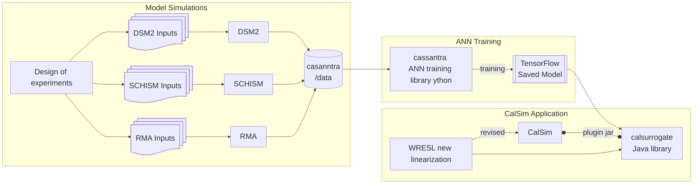

# Casanntra: Staged ANN Training for Simulation Model Surrogates

## Overview
**Casanntra** is a utility designed for training surrogate models based on simulation outputs, with a primary focus on hydrodynamic and water quality models of the Bay-Delta system. The package supports **transfer learning** across a sequence of models and is structured around **deliberate design of experiments** for input cases. This approach enables more efficient learning, especially when high-dimensional models have limited training data. The library and its constituent data were developed jointly by DWR and Resource Management Associates (RMA) in a project funded and administered by the Delta Science Program. The full toolkit includes CalSim itself, the [calsurrogate](https://github.com/CADWRDeltaModeling/calsurrogate) library that allows the incorporation of a variety of surrogates into CalSim and an associated [test problem ](https://github.com/CADWRDeltaModeling/calsurrogate-test). The workflow and relationship between these components is approximated below. 


## Core Concepts
### Data Model Terminology
- **Model**: In the input data, the model refers to the process-based model exercised when producing the file. This is the training target. During transfer learning we use the terms "source" and "target".
- **Scene**: A collection of time-series data associated with a specific case, forming the input-output structure for training. For instance a very important case in Bay-Delta hydrodynamic modeling is the "base" case representing current conditions.
- **Case**: A distinct configuration of input conditions, typically representing a specific set of boundary conditions or forcing parameters in the simulation model. A given year may be represented by many cases each with a different perturbation. A case is the way we represent design of experiments (DOE).
- **Cross-validation**: A strategy to maximize data utility by dividing cases into training and validation sets while ensuring temporal and case-based consistency. In cross-validation a `fold` is witheld.

Further discussion of data inputs/outputs and sign conventions are discussed [here](data/readme.md). 

## Cross-Validation
Higher-dimensional models often have limited training data due to computational constraints. To effectively assess model generalization, **K-fold cross-validation** is applied, ensuring:
- Cases remain intact across folds.
- A **target duration** is maintained, ensuring the trained ANN learns meaningful temporal patterns. Because training data tends to include histories of data (90 past days typical), cases and folds and histories have to be managed together so that we don't mix data from different cases.
- The folds are currently run using multiprocessing on concurrent futures. Someone with experience in TensorFlow might be able to come up with a distributed strategy in TF that still preserves the folding strategy. 

## Input Normalization and Scaling
Casanntra applies **feature normalization and scaling** to inputs and outputs to improve training stability. This includes:
- Standardization (zero mean, unit variance) where appropriate.
- Min-max scaling for bounded variables.
- Transformations to make up for poor gradients and near-saturation, which are inherant in the Bay-Delta system on the larger rivers. Our rivers fluctuate to high flows (300,000cfs) which is an order of magnitude higher than the level that elicits salinity responses. See the `scaling.py` folder. This should become configurable in the near future.
- Ensuring consistent transformations between base and transfer learning scenarios.

## Transfer Learning Strategies
Casanntra implements multiple flavors of **transfer learning**, enabling surrogate models to adapt efficiently across different levels of model fidelity:

### Direct Transfer Learning
- This is a straightforward continuation of training from a base model.
- The pre-trained model is used as a starting point, with training continuing directly on the target data.

### Contrastive Transfer Learning
- Introduces both a **source model** and a **target model**.
- Both models are revised simultaneously, balancing error across their respective objectives.
- This method ensures that shared structures between models are reinforced while allowing each model to refine its domain-specific details.

### Difference-Based Transfer Learning
- Focuses on adjusting the target model without modifying the source model.
- Optimizes the surrogate model not only for the target scenario but also for accurately representing the differences between the source and target cases.
- This approach is still under development and not fully implemented.

Each of these methods applies a combination of **"freezing" and restarting with low learning rates** to control model updates effectively. As part of this abstraction, each step in the training sequence consists of an **initial phase** and a **main phase**, ensuring stability and gradual adaptation to the new data.


## Postprocessing: Export and Conversion to Native Units
The trained neural network models in this framework are stored in **scaled units** for numerical stability during training. However, when deploying models for real-world applications or integrating with external frameworks (e.g., Java-based systems, TensorFlow Serving for CalSim), it is often necessary to convert the model outputs back to **native physical units**. This section outlines the procedures for:
- **Wrapping trained models** with an `UnscaleLayer` to restore outputs to native units.
- **Exporting trained models** from `.h5` to TensorFlow’s **SavedModel (`.pb`) format**.
- **Checking model predictions** after conversion.

### Exporting a Model with Native Units
These two tasks are done with a utility. The `UnscaleLayer` applies the inverse scaling transformation to produce **real-world values** at inference time, such as micromhos/cm specific conductance or an X2 value in kilometers.

#### **Conversion Process: H5 → TF SavedModel Format**
To convert an `.h5` model into **TensorFlow’s SavedModel format**, follow these steps:
1. **Find the trained model (`.h5`) and YAML config (`.yml`) used in training.**
2. **Run the conversion script**:
   ```bash
   python convert_and_validate.py transfer_config.yml my_trained_model.h5 my_input_data.csv


## Next Steps
- **Expand documentation** to include example workflows.
- **Provide visualizations** demonstrating case divisions and cross-validation splits.
- **Optimize transfer learning workflows** for different model architectures.

This README follows **Markdown (.md) format** to facilitate version control and GitHub compatibility.


See also
https://github.com/CADWRDeltaModeling/calsurrogate

Interoperability standards are in the wiki:
https://github.com/CADWRDeltaModeling/casanntra/wiki
